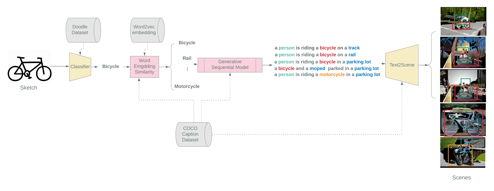
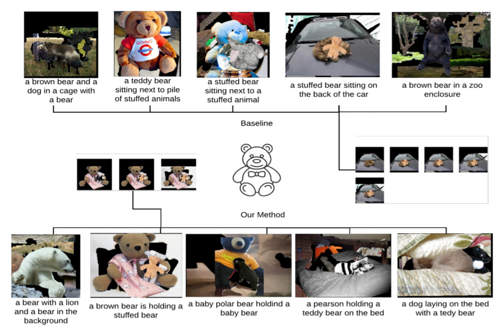
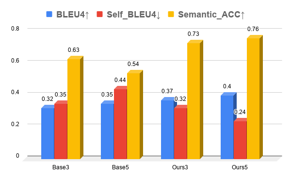
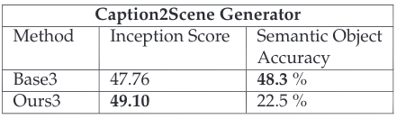

# An Enhanced Sketch2Scene Using Natural Language

## Introduction 
Translating a sketch into a scene is a challenging
computer vision task. Realistic and meaningful
scenes should contain multiple objects as well as
a corresponding background, which is hard to
extrapolate from a single input object. In this
project, we propose a new approach to enhance
the Sketch2Scene translation task using natural
language processing techniques. Below is our
scope of the project.

- Implement a new pipeline to generate realistic scenes from a single sketch
- Show how NLP can improve the Sketch2Scene task with respect to quality and diversity

## Approach 
The pipeline has three steps. First, Sketch
Classifier predicts the class name of the object
in the input sketch. Then, Caption Generator
produces diverse captions based on the estimated
most-similar words of the class name using
retrofitted word2vec embeddings. Finally, the
Caption2Scene model retrieves the objects and
composes them to generate a new scene.

* `Sketch Classifier`: MobilenetV2 pre-trained on
ImageNet is fine-tuned using google Quickdraw
dataset. 

* `Caption Generator`:

  • Baseline: Words similar to doodle class output
from word2vec embeddings are used as a
condition to generate captions.

  • Our Method: We retrofit the GloVe embeddings
using object-relationship of the COCO caption
dataset to improve the similarity among
multiple objects in a scene. During training,
we randomly sample conditional words from
top-10 similarity, and for inference, use beam
search to improve the quality and diversity of
the generated captions.

* `Caption2Scene`: We infer the scenes using a
pre-trained text2scene model which learns to
retrieve objects and arrange them in the scene
using the semantic relationship of the objects in the
captions.

## Results
You will find our results in [the short verion](https://github.com/suhongkim/Enhanced-Sketch-To-Scene/blob/main/EnhancedSketch2SceneUsingNaturalLanguage_post.pdf) and [the detailed report](https://github.com/suhongkim/Enhanced-Sketch-To-Scene/blob/main/EnhancedSketch2SceneUsingNaturalLanguage_report.pdf)

Our method produces high quality (High BLEU4 score) and more diverse (Lower Self-BLEU4score) captions given sketch input. Our
method generates captions which have better correspondence with input sketch (HigherSemantic Accuracy)

Our method generates better captions resulting in better scenes (higher Inception score).
Caption2Scene model generates the scenes with more diverse objects and relationships,
which are unseen by YOLOv3 detector (Lower SOA score)

## How to Run 
Check each README.md file in three modules: [CaptionGenerator](CaptionGenerator/README.md), [Sketch_classifier](Sketch_classifier/README.md), and [Text2Scene](Text2Scene/README.md)

## Authors
This project is done by team of three for each module
- CaptionGenerator - [Suhong kim](https://www.linkedin.com/in/suhongkim/)
- Sktech Classifier - [Sara Jalili](https://www.linkedin.com/in/sara-jalili/)
- Text2Scene - [Vishnu Sanjay Ramiya Srinivasan](https://www.linkedin.com/in/vishnu-sanjay-rs/)

## References
[1]  F. Tan, S. Feng, and V. Ordonez, “Text2scene:  Generating compositional scenes from textualdescriptions,” 2018. \
[2]  “COCO Datset.”http://cocodataset.org/#home. \
[3]  “Quick,   Draw!Doodle   Recognition   Challenge.”https://www.kaggle.com/c/quickdraw-doodle-recognitio 
