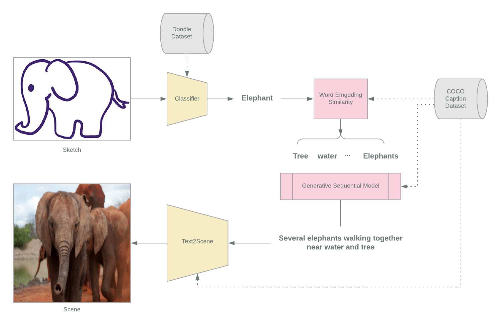

# An Enhanced Sketch2Scene Using Natural Language

## Motivation
In this project, we would like to combine computer vision and Natural language Processing to transform an incomplete sketch into a scene. The primary purpose of this project is to enhance our understanding of word embedding and sequential language models and use computer vision as a tool to express it. So instead of directly transforming an image into another, we transform the image into text and then process that text to create longer sentences and then use it to generate an image. The first step is to classify the input sketch using a CNN based classifier. Once we have the class of the sketch, we find the most similar words related to that class. We generate a natural language scene description, conditioned on the class, and its similar words. Then we use a separate system that takes in the scene description and generates an image. 

## Approach 
Inspired by the assignment 2 for finding similar words, we are using a pre-trained Glove embedding and retrofitting based on the COCO caption dataset related to the scene description. Similar to assignment 4, we will use an encoder-decoder based sequential model which encodes the group of similar words and use it to generate the scene description. The last step is to feed the generated description into a pre-trained text2Scene model[1] to generate the final image.

<!---->

## Data
- COCO Caption Dataset [2]
- Doodle Dataset  [3]

## References
[1]  F. Tan, S. Feng, and V. Ordonez, “Text2scene:  Generating compositional scenes from textualdescriptions,” 2018. \
[2]  “COCO Datset.”http://cocodataset.org/#home. \
[3]  “Quick,   Draw!Doodle   Recognition   Challenge.”https://www.kaggle.com/c/quickdraw-doodle-recognitio 